# Sistema de Gestión de Vehículos – Laravel 10

Este proyecto implementa un CRUD completo para la gestión de vehículos, permitiendo registrar, editar, listar y eliminar información dentro de un sistema básico de administración.  
Fue desarrollado con Laravel 10, siguiendo buenas prácticas de arquitectura MVC.

---

## Tecnologías utilizadas

- Laravel 10
- PHP 8.2
- MySQL
- Bootstrap 5
- Blade Templates

---
## Crear Repositorio en GitHub 

### Creacion del Proyecto en GitHub

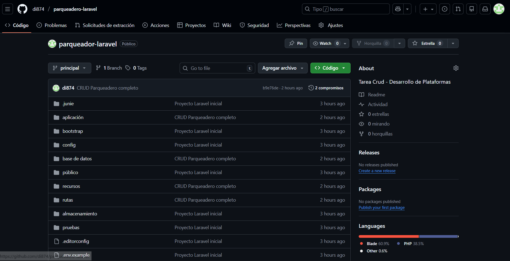

## Crear el Proyecto con Laravel

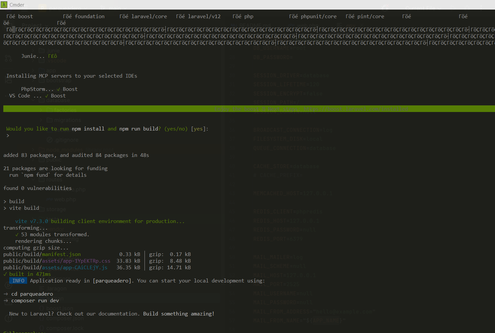

### Prueba Conección Laravel

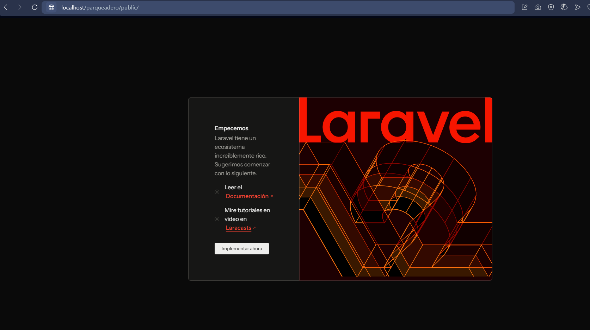

### Conexion GitHub

##Configurar Base de Datos

### Configuración y conexión a la base de datos
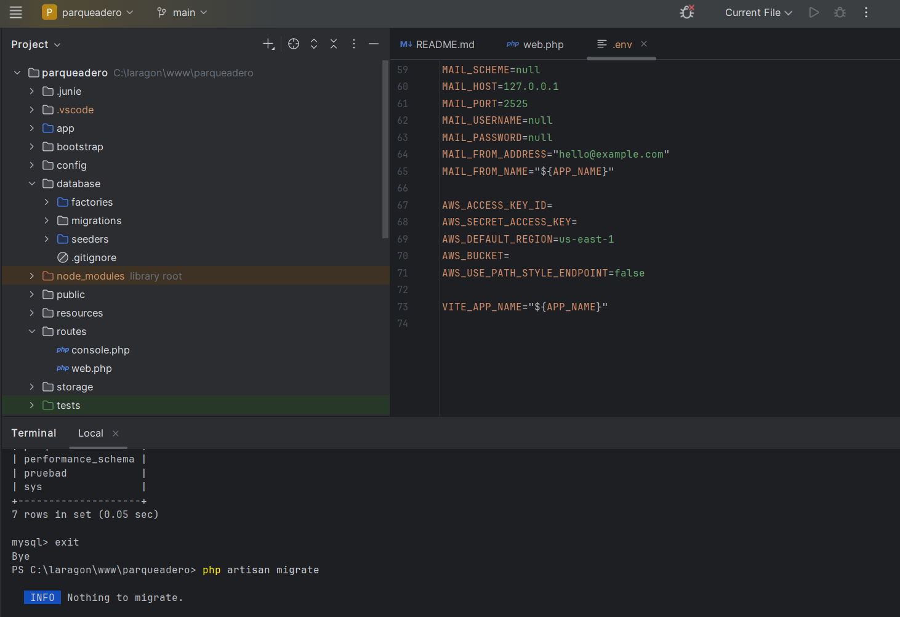

## Crear Migración, Modelo y Controlador 

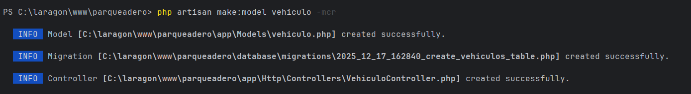

## Definir la Tabla (Migración)

###Migracion 

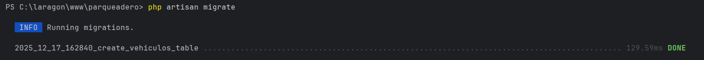

## Configurar Vehiculo 

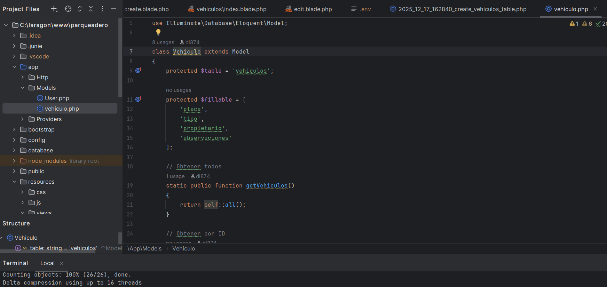

## Rutas del sistema

## Configuracion de rutas 

### Vista principal (Index)

### Crear Controlador
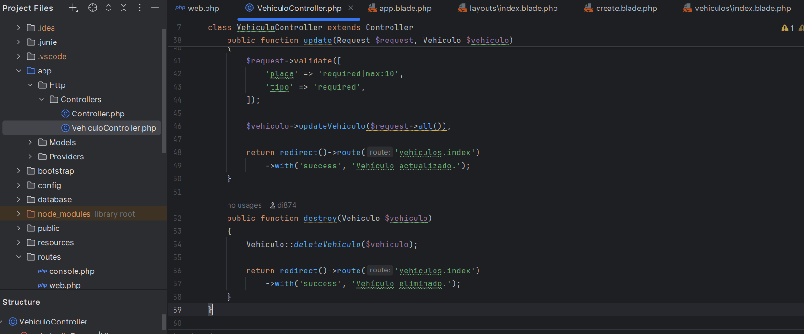

### Crear Layout

### Crear Index
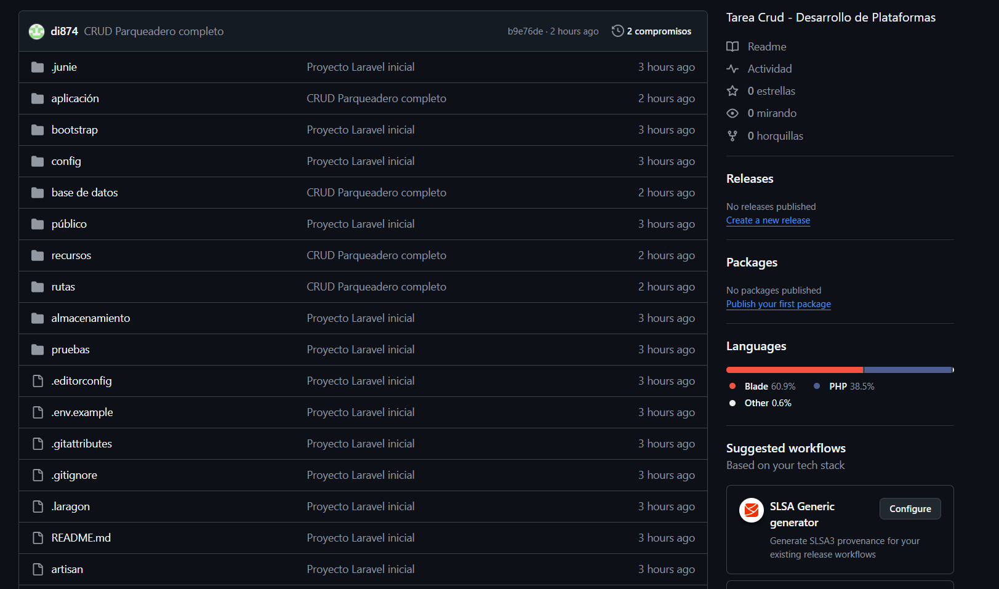

### Create Blade Vehiculos
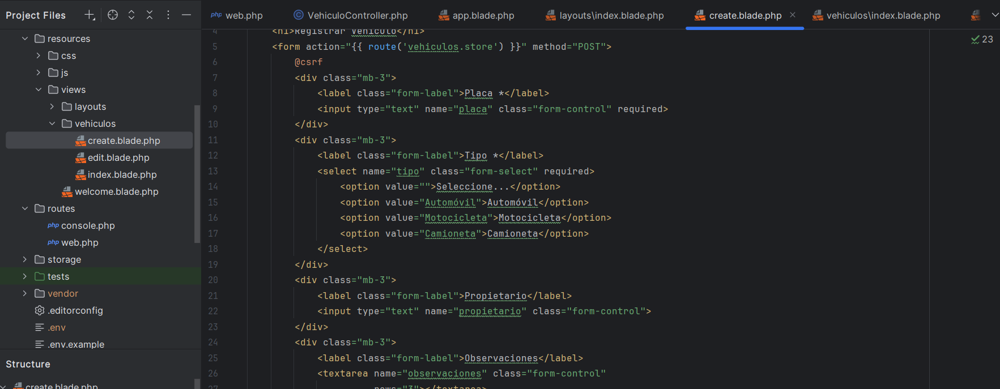

### Edit Blade Vehiculos
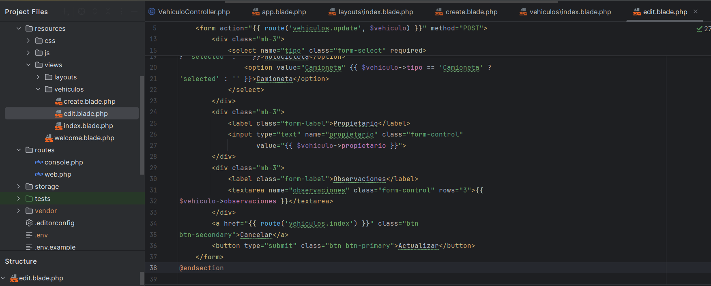

## Probar Aplicación

### Prueba de Aplicación
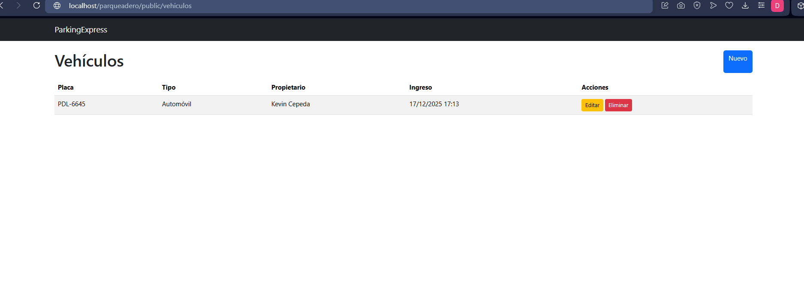

### Prueba de Editar
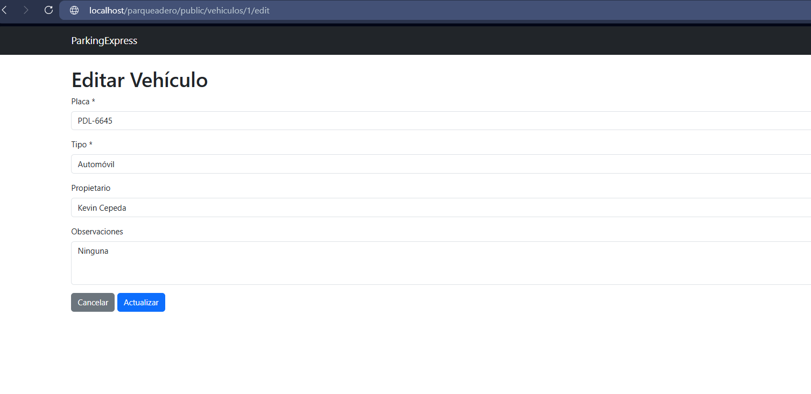

### Prueba de Eliminar
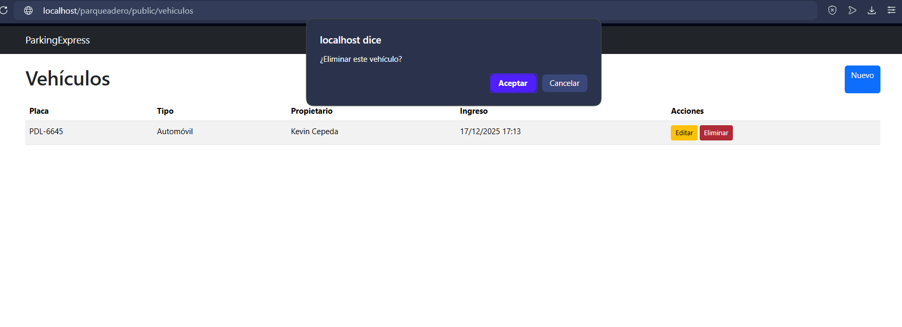
