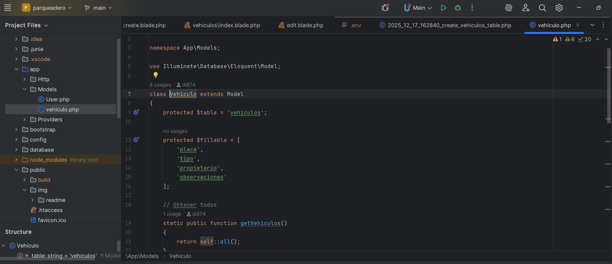
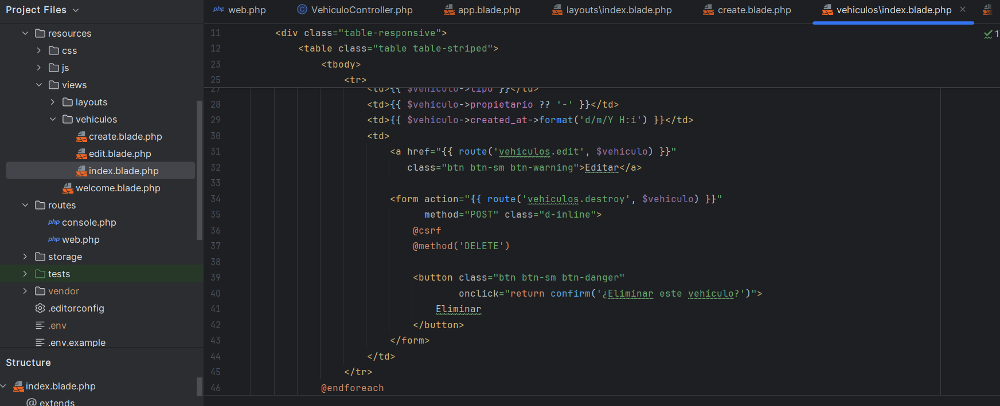
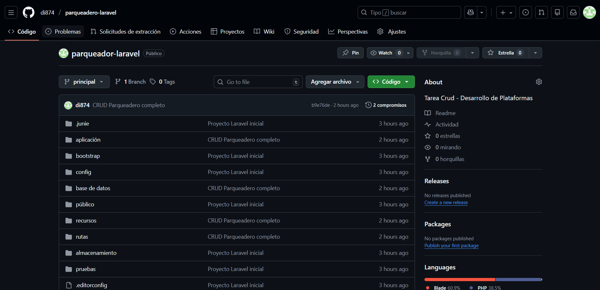

# 🚗 Sistema de Gestión de Vehículos – Laravel 10

Este proyecto implementa un CRUD completo para la gestión de vehículos, permitiendo registrar, editar, listar y eliminar información dentro de un sistema básico de administración.  
Fue desarrollado con Laravel 10, siguiendo buenas prácticas de arquitectura MVC.

---

## 📦 Tecnologías utilizadas

- Laravel 10
- PHP 8.2
- MySQL
- Bootstrap 5
- Blade Templates

---

## Estructura del Proyecto
---

## ⚙️ Configuración del Proyecto

### Configuración y conexión a la base de datos


### Prueba de conexión


### Página inicial funcionando


---

## 🛠️ Migración, Modelo y Controlador

### Migración


### Modelo Vehiculo.php


### Migración, modelo y controlador juntos


### Controlador


---

## 🌐 Rutas del sistema


---

## 🖼️ Vistas Blade

### Vista principal (Index)


### Formulario de creación


### Formulario de edición


---

## 🔗 GitHub y control de versiones

### Creación del repositorio


### Conexión con GitHub


### Cambios enviados


---

## 🚀 Instalación del proyecto

Sigue estos pasos para ejecutar el proyecto localmente:

```bash
git clone <URL_DEL_REPOSITORIO>
cd <nombre-del-proyecto>

composer install

cp .env.example .env
php artisan key:generate

# Configura tu base de datos en el archivo .env

php artisan migrate
php artisan serve
