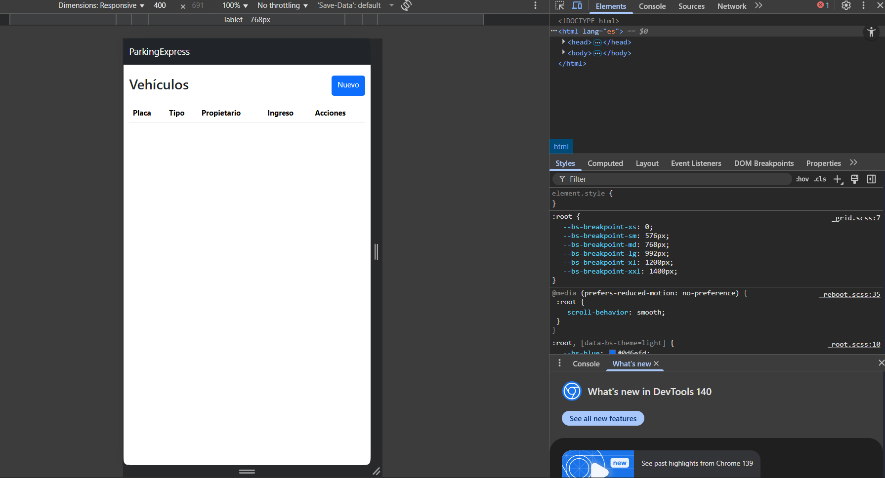

# Sistema de Gestión de Vehículos – Laravel 10

Este proyecto implementa un CRUD completo para la gestión de vehículos, permitiendo registrar, editar, listar y eliminar información dentro de un sistema básico de administración.  
Fue desarrollado con Laravel 10, siguiendo buenas prácticas de arquitectura MVC.

---

## Tecnologías utilizadas

- Laravel 10
- PHP 8.2
- MySQL
- Bootstrap 5
- Blade Templates

---
## Crear Proyecto

Antes de iniciar el desarrollo del sistema, se verificó que el entorno de trabajo contara con todas las herramientas necesarias, se confirmó la instalación de Laravel como servidor local, Git para el control de versiones, una cuenta activa en GitHub para alojar el repositorio remoto, y un motor de base de datos como MySQL o PostgreSQL, además, se dispuso de un IDE configurado adecuadamente, lo que permitió comenzar el proyecto con una base técnica sólida y sin contratiempos.

### Creacion del Proyecto en GitHub

Se creó el repositorio remoto denominado parqueadero-laravel, el cual serviría como punto central para almacenar el código del proyecto, este paso permitió habilitar el control de versiones desde el inicio, garantizando trazabilidad, respaldo y la posibilidad de sincronizar los cambios entre el entorno local y GitHub.

## Crear el Proyecto con Laravel

El entorno de desarrollo fue optimizado mediante la instalación de extensiones y plugins especializados para Laravel, tanto en PHPStorm como en Visual Studio Code se habilitaron herramientas de autocompletado, navegación entre rutas y vistas, formateo automático de Blade y soporte para archivos .env. Esta configuración mejoró significativamente la productividad y redujo errores durante la implementación del CRUD.

### Prueba Conección Laravel

### Conexion GitHub

##Configurar Base de Datos

Se creó la base de datos parqueadero y se configuró la conexión en el archivo .env, tras ajustar los parámetros de conexión, se ejecutaron las migraciones iniciales de Laravel, confirmando que la comunicación entre la aplicación y la base de datos era exitosa, este paso dejó lista la infraestructura para almacenar los registros del CRUD.

### Configuración y conexión a la base de datos

## Crear Migración, Modelo y Controlador 

Mediante un único comando de Artisan se generaron automáticamente la migración, el modelo y el controlador del recurso Vehiculo, esta acción permitió establecer la estructura inicial del CRUD, siguiendo el patrón MVC de Laravel y asegurando una organización clara del código.

## Definir la Tabla (Migración)

La migración generada fue editada para definir la estructura de la tabla vehiculos, incluyendo campos como placa, tipo, propietario y observaciones, una vez configurada, la migración se ejecutó correctamente, creando la tabla en la base de datos y dejando lista la estructura para almacenar los registros.

###Migracion 

## Configurar Vehiculo 

El modelo fue configurado para asociarse explícitamente con la tabla vehiculos y permitir la asignación masiva de los campos necesarios, además, se implementaron métodos estáticos que facilitan la obtención, creación, actualización y eliminación de registros, centralizando la lógica de acceso a datos.

## Rutas del sistema

## Configuracion de rutas 

Se definieron las rutas del sistema utilizando el recurso RESTful de Laravel, lo que habilitó automáticamente todas las rutas necesarias para el CRUD, la ruta principal del proyecto fue configurada para redirigir al listado de vehículos, facilitando la navegación del usuario.

### Vista principal (Index)

### Crear Controlador

El controlador VehiculoController fue completado con los métodos correspondientes a cada operación del CRUD, se incluyó validación de datos, manejo de redirecciones y mensajes de éxito, garantizando un flujo adecuado entre la lógica del sistema y las vistas.

### Crear Layout

Se desarrolló un layout principal utilizando Bootstrap 5, el cual incluye una barra de navegación y una estructura base para todas las vistas, este layout permitió unificar el diseño del sistema y mantener una apariencia consistente en todas las pantallas del CRUD.

### Crear Index

Se implementó la vista principal del sistema, donde se muestra una tabla con todos los vehículos registrados, esta vista incluye botones para crear nuevos registros, editar los existentes y eliminarlos. Además, se incorporó un diseño responsive que permite visualizar correctamente la información desde dispositivos móviles.

### Create Blade Vehiculos

Se desarrolló el formulario para registrar nuevos vehículos, este formulario incluye campos obligatorios, validación, selección del tipo de vehículo y un área para observaciones, también se añadió un botón para regresar al listado sin realizar cambios.

### Edit Blade Vehiculos

Se creó la vista de edición, la cual muestra un formulario prellenado con los datos del vehículo seleccionado, desde esta pantalla es posible actualizar la información del registro de manera sencilla y segura, manteniendo la coherencia con el diseño general del sistema.

## Probar Aplicación

Se realizaron pruebas completas del sistema, verificando que todas las operaciones del CRUD funcionaran correctamente: creación, visualización, edición y eliminación de vehículos, también se comprobó la correcta visualización en dispositivos móviles, confirmando que el sistema es totalmente funcional y responsive.

### Prueba de Aplicación

### Prueba de Editar

### Prueba de Eliminar

### Prueba Movil

